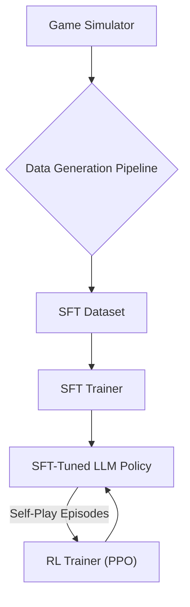

# Werewolf LLM

A project to train a Large Language Model to play One Night Ultimate Werewolf using Supervised Fine-Tuning (SFT) and Reinforcement Learning (RL).

## Project Overview

This project implements an intelligent agent capable of playing One Night Ultimate Werewolf (ONUW). The core methodology involves leveraging a small Large Language Model (LLM), fine-tuned through a combination of Supervised Fine-Tuning (SFT) and Reinforcement Learning (RL) via self-play. The agent learns strategic communication, deception, and deduction to achieve victory for its team.

## Architecture

The system architecture is designed to train the LLM agent in two main phases:

1.  **Supervised Fine-Tuning (SFT)**: A base LLM is fine-tuned on a dataset generated by rule-based agents. This phase teaches the model the game's rules, vocabulary, and how to produce structured output.
2.  **Reinforcement Learning (RL)**: The SFT-tuned model is further trained via self-play using PPO. In this phase, the agent learns to optimize its strategy to maximize its team's win rate.



## Development Environment

This project is configured to run in a VS Code Dev Container, which provides a reproducible development environment. You can configure it to run on CPU, NVIDIA (CUDA), or AMD (ROCm) hardware.

### Backend Configuration

To select the compute backend for your hardware:

1.  **Copy the environment configuration file:**
    ```bash
    cp .devcontainer/.env.example .devcontainer/.env
    ```

2.  **Set the `BACKEND` variable** in `.devcontainer/.env`:
    -   `BACKEND=cpu` (Default)
    -   `BACKEND=cuda` (for NVIDIA GPUs)
    -   `BACKEND=rocm` (for AMD GPUs)

If the `.env` file is not present, the environment will default to `cpu`. The dev container will automatically use the correct configuration when it is built.

### Prerequisites

-   [Docker](https://docs.docker.com/get-docker/)
-   [Docker Compose](https://docs.docker.com/compose/install/)
-   [VS Code](https://code.visualstudio.com/)
-   [Dev Containers extension](https://marketplace.visualstudio.com/items?itemName=ms-vscode-remote.remote-containers) for VS Code.

### Setup

1.  **Clone the repository:**
    ```bash
    git clone https://github.com/merklejerk/werewolf-llm.git
    cd werewolf-llm
    ```

2.  **Open in Dev Container:**
    Open the cloned repository folder in VS Code. You will be prompted to "Reopen in Container". Click it to build and launch the dev container.

3.  **Create a virtual environment and install dependencies:**
    The base image comes with many packages pre-installed. Create a virtual environment that uses the system's site packages.

    ```bash
    # Create venv that can access system packages
    uv venv --system-site-packages

    # Install base and training dependencies
    uv sync --all-groups

    # Install package in edit mode
    uv pip install -e "."
    ```

## Usage

### 1. Generate SFT Training Data

Generate a dataset for the supervised fine-tuning phase. The script runs multiple game simulations with rule-based agents to create high-quality prompt/completion pairs.

```bash
# Generate 1000 games and save to ./data/sft
uv run gen-sft -n 1000 ./data/sft
```

### 2. Train the Model

The `train` script is the main entrypoint for SFT and RL training.

**To start a new SFT run from a base model:**

```bash
# Start training run 'my-first-run' from the gemma-2b base model
uv run train my-first-run \
  --base "google/gemma-2b-it" \
  --sft ./data/sft/sft_dataset.jsonl
```

The script will create a checkpoint directory at `checkpoints/my-first-run`.

**To resume a training run:**

If a checkpoint for the given run name exists, the script will resume training from it automatically.

```bash
# Resume the 'my-first-run' training run
uv run train my-first-run --sft ./data/sft/sft_dataset.jsonl
```

### 3. Run a Demo Game

Run a demo game:

```bash
python main.py
```

## Output Format

The model is trained to produce a structured JSON output.

Example training format:
```json
{
  "prompt": "[SYSTEM_INSTRUCTION] You are playing One Night Ultimate Werewolf...",
  "completion": "{\"publicStatement\": \"I am the Seer...\", \"privateRoleGuesses\": {\"PlayerA\": \"Villager\"}, \"vote\": \"PlayerB\"}",
  "metadata": {
    "player": "Alice",
    "initial_role": "Seer",
    "final_role": "Seer",
    "strategy_variant": "truthful"
  }
}
```

## Development

## Roadmap

- [x] Game simulator implementation
- [x] SFT data generation with rule-based agents
- [x] Flexible training script with checkpointing
- [ ] **SFT Training Pipeline**: Implement the full SFT training loop using `trl.SFTTrainer` and PEFT/LoRA.
- [ ] **RL Training Pipeline**: Implement the RL training loop using `trl.PPOTrainer` and self-play.
- [ ] **Evaluation**: Develop a robust evaluation harness to measure model performance (win rates, role accuracy).
- [ ] **Human vs AI**: Create an interface for humans to play against the trained agents.
